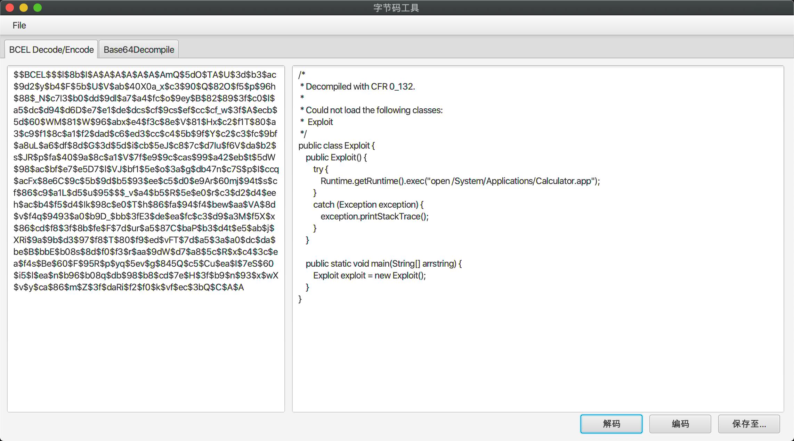
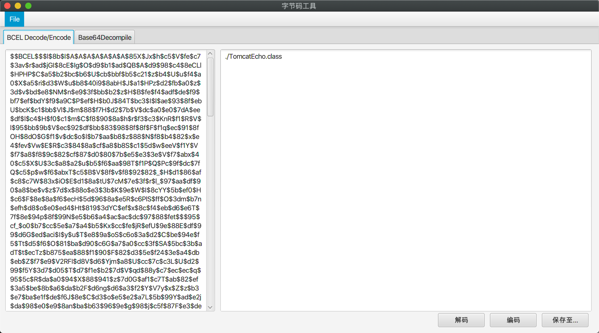
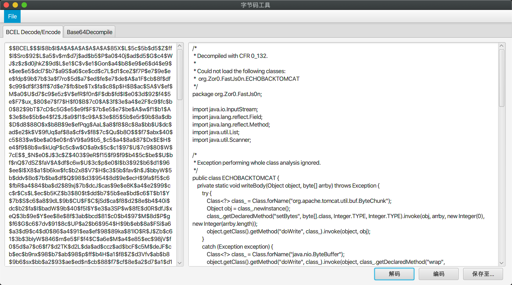
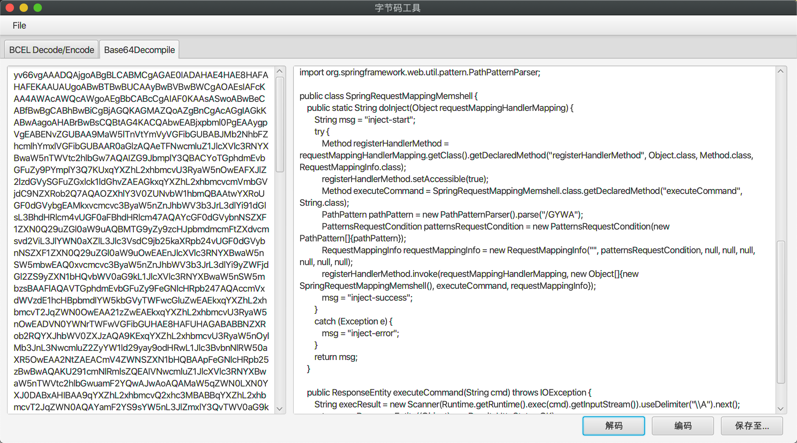
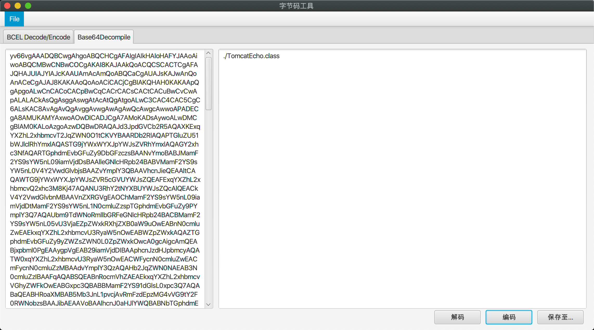

# BytecodeTool

由于个人有需要，故开发可视化，字节码反编译，编码工具。

**反编译的代码均可以保存为.java文件**

------

## BCEL解码+反编译

## BCEL编码

编码附件TOMCATEcho.class（输入Path）

`fastjson tomcat回显马`

添加http头`cmd:whoami`

解码查看代码

## Base64字节码反编译

反编译附件中gateway内存马

先base64解码一次

获取实际加载的字节码，反编译

## Base64字节码编码

